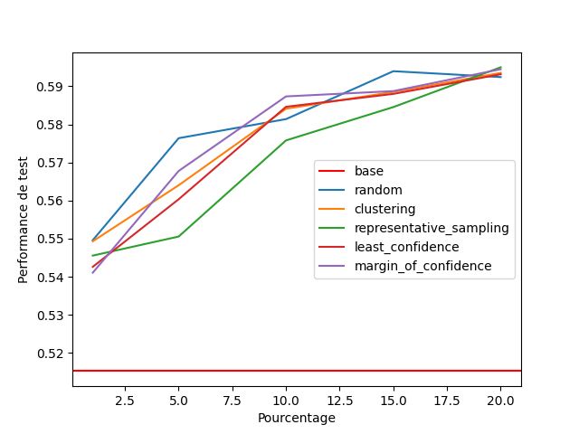
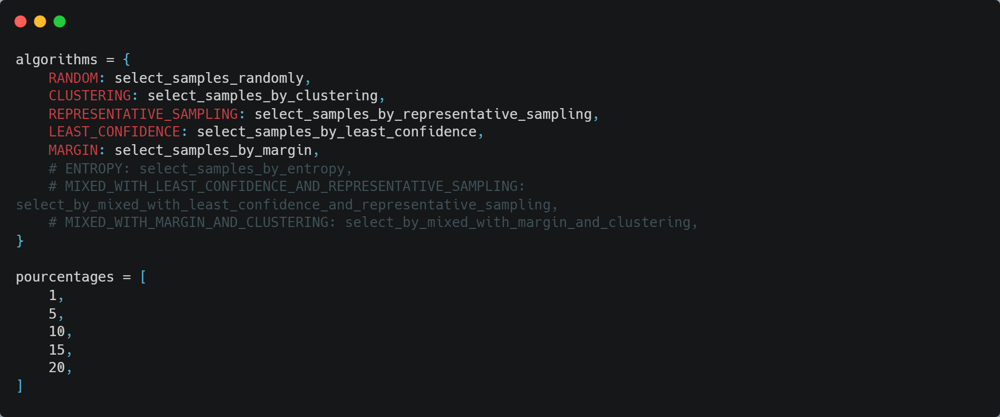

# 5-Stars Review Prediction
This project involves the development of a simple classifier designed to predict the star rating of a given clothing review. Initially trained on food reviews, the model is fine-tuned using an active learning approach to adapt to the nuances of clothing reviews, thereby optimizing its performance for this specific task.
# Goal of the project
The idea is to train a model on a large dataset of food reviews, then use it to predict the ratings of a clothing dataset. Then, we select the top n samples with a selection algorithm (such as random, least confidence, margin sampling, entropy sampling, clustering, or representative sampling) and add them to the training set. Finally, we retrain the model on the new training set and repeat the process for the desired selection algorithms and number of samples.  

Here is an example of the results obtained with the different selection algorithms for different number of samples:



# Requirements
## Datasets
- [Amazon Fine Food Reviews](https://www.kaggle.com/snap/amazon-fine-food-reviews/) : large dataset (more than 500K reviews) that consists of reviews of fine foods from amazon.
- [Women's E-Commerce Clothing Reviews](https://www.kaggle.com/datasets/nicapotato/womens-ecommerce-clothing-reviews) : This is a multidimensional, anonymized e-commerce dataset (around 23K reviews) for women's clothing, based on customer reviews, with references to the company replaced by "retailer".

Download the two datasets in CSV format, rename them to `ReviewsCloth.csv` and `ReviewsFood.csv`, and place them in the `data` folder.

## Python Packages
You need to install the following packages:
- **keras** for creating, training and testing model.
- **sklearn** for utils like splitting data.
- **tqdm** for printing progress bars.
- **pandas** for reading CSV files.
- **numpy** for mathematical operations.
- **matplotlib** for plotting.

You can install them using the following command:
```
pip install requirements.txt
```
# Test
In case you want to test the model directly with a review text, you can use the following command:
```
python test.py "Best Product Ever"
```
The output will be the predicted star rating for the given review, for example: 4/5.

# Train
You can train the model using the following command :
```
python train.py
```
You will obtain a file called `base_0.h5` in the `model` folder. However you can tune some parameters in `config.py` to improve **accuracy** such as number of LSTM units, embedding size, etc.

# Active Learning
To choose the selection algorithms and the number of samples, you can edit the `active_learning.py` file as follows:  



To run the active learning process, you can use the following command:
```
python active_learning.py
```
You will obtain a file called `results.json` in the `results` folder. This file contains the accuracy of the model on the clothing dataset after each iteration of the active learning process.

# Visualization
You can visualize the results of the active learning process using the following command:
```
python visualization.py
```
You will obtain a file called `results.png` in the `results` folder. This file contains the accuracy of the model on the clothing dataset after each iteration of the active learning process.  

You can also visualize the results for specific selection algorithms by passing them as arguments to the plot function in the `visualization.py` file:
```python
plot_graph(methods=[BASE, LEAST_CONFIDENCE, MARGIN, CLUSTERING], save_path='results/results_2.png')
```

After running the active learning process, you can examine the common samples selected by the model for a given number of samples for each selection algorithm. These records are stored in the `results` folder in the `in_common_n.csv` files where n stands for the number of selected samples. 